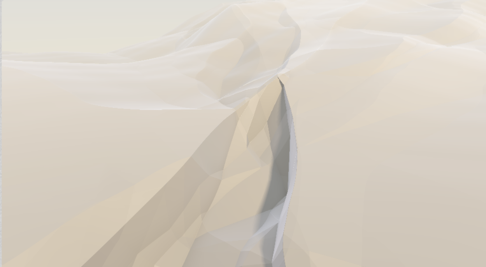
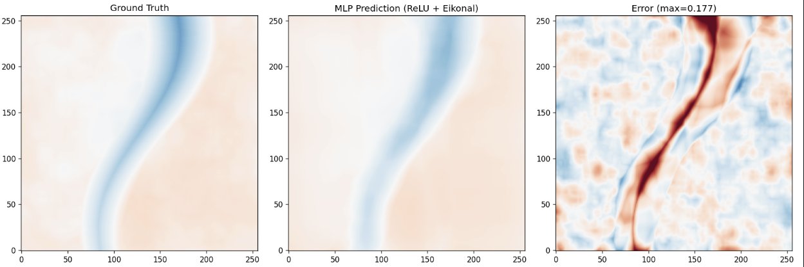

# HPG — Neural SDF in a Shader

Related notes for **HPG (High-Performance Graphics)** — neural implicit representation in shaders for global illumination.

Fits a signed distance field (SDF) to a procedural canyon terrain using a tiny ReLU MLP with 737 parameters, and exports the weights to GLSL, allowing for real-time rendering directly in the fragment shader via ray-marching.

This project is an implementation of neural implicit representation in shaders in the HPG (High-Performance Graphics) context, focused on SDFs for global illumination.
