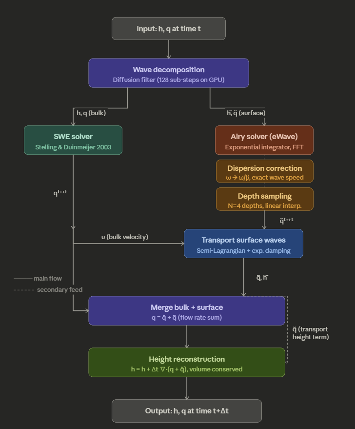
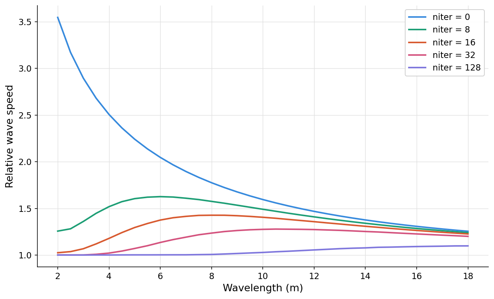

# Solver pipeline

## 1. Wave decomposition

### 1.1 Wave regimes

In wave theory, flows are often classified by the **ratio of water depth $h$ to wavelength $\lambda$**:

- **Deep water** (Deep Water): $h > \lambda/2$ — Airy wave
- **Intermediate depth**: $\lambda/20 \lt h \lt \lambda/2$
- **Shallow water** (Shallow Water): $h \lt \lambda/20$ — shallow water equations (SWE)

#### Dispersion: pure SWE vs Airy

$$c_{\text{SWE}} = \sqrt{gh}$$

$$c_{\text{Airy}} = \frac{\omega}{k} = \sqrt{\frac{g\tanh(kh)}{k}}$$

$$\frac{c_{\text{SWE}}}{c_{\text{Airy}}} = \frac{\sqrt{gh}}{\sqrt{\dfrac{g\tanh(kh)}{k}}} = \sqrt{\frac{kh}{\tanh(kh)}}$$

$$\frac{c_{\text{SWE}}}{c_{\text{Airy}}} = \sqrt{\frac{kh}{\tanh(kh)}} $$

$$\frac{c_{\text{SWE}}}{c_{\text{Airy}}} = \sqrt{\frac{2\pi h/\lambda}{\tanh(2\pi h/\lambda)}}$$

$$\frac{c_{\text{SWE}}}{c_{\text{Airy}}} = \sqrt{\frac{\xi}{\tanh\xi}} $$
For $\xi \to 0$ ($h \ll \lambda$):

$$\tanh\xi \approx \xi \quad\implies\quad \frac{c_{\text{SWE}}}{c_{\text{Airy}}} \to \sqrt{\frac{\xi}{\xi}} = 1$$

SWE and Airy agree in this limit.

For $\xi \to \infty$ ($h \gg \lambda$):

$$\tanh\xi \to 1 \quad\implies\quad \frac{c_{\text{SWE}}}{c_{\text{Airy}}} \to \sqrt{\xi} = \sqrt{kh}$$

The ratio grows with $\sqrt{kh}$, and SWE significantly overestimates phase speed.

### 1.2 Decomposition of height and flux

Decompose free-surface height $h$ and flux $\mathbf{q}$ as

$$h = \bar{h} + \tilde{h}, \quad \mathbf{q} = \bar{\mathbf{q}} + \tilde{\mathbf{q}}$$

- $\bar{h}, \bar{\mathbf{q}}$: **low-frequency bulk** component, with $h \ll \lambda$, evolved with the shallow water equations (SWE).
- $\tilde{h}, \tilde{\mathbf{q}}$: **high-frequency surface-wave** component, under Airy wave assumptions.

### 1.3 Continuity equation expansion

$$\frac{\partial h}{\partial t} = -\nabla \cdot \left(\bar{h}\bar{\mathbf{u}}\right) - \nabla \cdot \left(\tilde{h}\tilde{\mathbf{u}}\right) - \nabla \cdot \left(\tilde{h}\bar{\mathbf{u}}\right) - \nabla \cdot \left(\bar{h}\tilde{\mathbf{u}}\right)$$

The fourth term is dropped: under Airy assumptions for $\tilde{\mathbf{u}}$, its amplitude is too small to drive column-integrated flux through $\bar{h}$, so only the first three terms are retained.

### 1.4 Splitting waves with diffusion

Use the **diffusion equation** as a low-pass filter:

$$\frac{\partial H}{\partial T} = \nabla \cdot (\alpha \nabla H)$$

In Fourier space this is equivalent to

$$\hat{H}(k, T_0 + T) = \hat{H}(k, T_0) e^{-k^2 \alpha T}$$

High wavenumbers are damped exponentially, leaving low-frequency $\bar{H}$; with $\tau = 0$ we obtain

$$\bar{h} = \bar{H}, \quad \tilde{h} = h - \bar{h}$$

$$\alpha = \frac{h^2}{64} \cdot e^{-d |\nabla h|^2}$$

**Iterations** count explicit diffusion substeps per overall step.

Each substep timestep $\Delta T$ is clamped to the maximum stable value. To accumulate enough diffusion, we run **128** iterations.

| Iterations | Effect |
| :--- | :--- |
| 8 | Under-filtering: many waves are still treated as shallow water; speeds are too fast and inaccurate |
| 128 | Well filtered: most waves are handed to the Airy solver; speeds are close to theory |
---

---
## 2. SWE & Airy Solver

### 2.1 SWE Solver

Shallow-water discretization follows <a href="#ref-chentanez-2010">[Chentanez & Müller 2010]</a>.

$$\frac{d\bar{h}_{i,j}}{dt} + \frac{\bar{h}_{i+1/2,j}\vec{u}_{i+1/2,j}^{\uparrow} - \bar{h}_{i-1/2,j}\vec{u}_{i-1/2,j}^{\uparrow}}{\Delta x} + \frac{\bar{h}_{i,j+1/2}\vec{u}_{i,j+1/2}^{\uparrow} - \bar{h}_{i,j-1/2}\vec{u}_{i,j-1/2}^{\uparrow}}{\Delta x} = 0$$

$$\frac{d\vec{u}_{i+1/2,j}^{\to}}{dt} + \frac{\vec{q}_{i,j}^{\uparrow}}{\bar{h}_{i+1/2,j}} \frac{\vec{u}_{i+1/2,j}^{\to} - \vec{u}_{i-1/2,j}^{\to}}{\Delta x} + \frac{\vec{q}_{i,j-1/2}^{\uparrow}}{\bar{h}_{i+1/2,j}} \frac{\vec{u}_{i+1/2,j}^{\to} - \vec{u}_{i+1/2,j-1}^{\to}}{\Delta x} + g \frac{\bar{h}_{i+1,j} - \bar{h}_{i,j}}{\Delta x} = 0$$

### 2.2 Airy Solver

The exponential integrator from <a href="#ref-tessendorf-2014">eWave [Tessendorf 2014]</a> runs in Fourier space.

$$\hat{\tilde{h}}^t \leftarrow \text{FFT} \left[ \frac{\tilde{h}^{t-\Delta t/2} + \tilde{h}^{t+\Delta t/2}}{2} \right]$$

$$\hat{\tilde{\mathbf{q}}}^t \leftarrow \text{FFT} [\tilde{\mathbf{q}}^t]$$

$$\tilde{\mathbf{q}}^{t+\Delta t} \leftarrow \text{iFFT} \left[ \cos(\omega \Delta t) \hat{\tilde{\mathbf{q}}}^t - \sin(\omega \Delta t) \frac{\omega}{k^2} \frac{\partial \hat{\tilde{h}}^t}{\partial x} \right]$$

---

**Dispersion relation:**

$$\omega = \frac{1}{\beta} \sqrt{gk \tanh(k \bar{h})}$$

$$\beta = \sqrt{\frac{2k}{\Delta x} \sin \left( \frac{k \Delta x}{2} \right)}$$

## 4. Transport

### 4.1 Damping operator

Damping builds on <a href="#ref-jeschke-2015">[Stefan Jeschke & Chris Wojtan, 2015]</a> and <a href="#ref-tessendorf-2017-gilligan">[Jerry Tessendorf, 2017]</a>.

$$G(\nabla \cdot \mathbf{u}) = \min(-\nabla \cdot \mathbf{u}, -\gamma \nabla \cdot \mathbf{u})$$

The damping update uses exponential evolution:

$$\phi_{\text{damped}} = \phi^n \cdot \exp\left( \text{clamp}(G \cdot \Delta t) \right)$$

### 4.2 Semi-Lagrangian advection

The advection term handles the convective part of the material derivative, $\frac{D\phi}{Dt} = 0$. At spatial location $\mathbf{x}$, the updated value is

$$\phi^{n+1}(\mathbf{x}) = \mathcal{B} \left( \phi_{\text{damped}}, \mathbf{x} - \mathbf{v}(\mathbf{x}) \Delta t \right)$$

* $\mathcal{B}(\phi, \mathbf{x}_d)$ is **bilinear interpolation** of $\phi$ at $\mathbf{x}_d$.

**Velocity field $\mathbf{v}$:**
* When updating $\tilde{q}_x$: $\mathbf{v}$ is the interpolated velocity on $x$-face centers.
* When updating $\tilde{q}_y$: $\mathbf{v}$ is the interpolated velocity on $y$-face centers.
* When updating $\tilde{h}$: $\mathbf{v}$ is the cell-centered average velocity.

### 4.3 Operator splitting

$$\frac{\partial \tilde{\mathbf{w}}}{\partial t} + \underbrace{(\mathbf{u} \cdot \nabla) \tilde{\mathbf{w}}}_{\text{Advection}} = \underbrace{G(\nabla \cdot \mathbf{u}) \tilde{\mathbf{w}}}_{\text{Damping Source}}$$

$$\frac{d\tilde{\mathbf{w}}}{dt} = G \tilde{\mathbf{w}} \implies \tilde{\mathbf{w}}^* = \tilde{\mathbf{w}}^n e^{G \Delta t}$$

$$\frac{\partial \tilde{\mathbf{w}}}{\partial t} + (\mathbf{u} \cdot \nabla) \tilde{\mathbf{w}} = 0 $$

## 5. Merge

### 5.1 Merge flux

$$\mathbf{q}^{t+\Delta t} = \bar{\mathbf{q}}^{t+\Delta t} + \hat{\tilde{\mathbf{q}}}^{t+\Delta t}$$

---

### 5.2 Merge height

$$h^{t+3\Delta t/2} = h^{t+\Delta t/2} + \Delta t \nabla \cdot (\mathbf{q}^{t+\Delta t} + \breve{\mathbf{q}}^{t+\Delta t})$$

# Shader

## 1. Height-field rendering  

输入是格点角上的 $(i,j)$。用 texelFetch 从 $uH$、$uB$ 纹理里取相邻格子的水深和地形，在角上平均得到水面高度 $y$ 和平均水深 $vDepth$，再乘 $uMVP$ 得到 $gl_Position$，并把世界坐标、深度传给片元阶段.  

用 $dFdx/dFdy$ 对世界坐标求屏幕空间导数，叉乘得到法线；按 $vDepth$ 在深蓝/浅青之间插值，再乘方向光 $uLightDir$ 做简单 Lambert，输出带 $uAlpha$ 的颜色。

## 2. Lighting

光源：$uLightDir$ 表示平行光方向  

漫反射：$ndl = max(dot(N, L), 0.0)$，即 Lambert：只保留法线与光方向夹角的余弦，背面为 0  

最终颜色：$baseColor * (ambient + weight * ndl)$，即常数环境项 + 加权的 $N·L$，系数在不同材质里略有不同。

| Status | Milestone | Goal |
| :--- | :--- | :--- |
| ✅ | **Height-field rendering** | Visualize the free surface in real time from simulated depth and bed height. |
| 🔄 | **Water — lighting** | Define sun/key light and how it hits the surface so all water terms share one coherent setup. |
| 🔄 | **Water — diffuse** | Lambertian or rough diffuse response from the surface normal so the body of water reads in shade and light. |
| ⬜ | **Water — specular** | Glossy / specular lobes and Fresnel-aware highlights for sun glints and viewing angle. |
| ⬜ | **Water — normal mapping** | Break up large facets with tiled or procedural normal detail on top of the displaced mesh. |
| ⬜ | **Water — refraction** | Show what is under the surface with chromatic or single-layer refraction of the scene or bed. |
| ⬜ | **Water — transparency** | Control opacity by depth, wet fraction, and Fresnel so shallow vs deep reads correctly. |
| ⬜ | **Optional: Water — caustics** | Light focusing patterns underwater or on the bed from a refractive surface. |
| ⬜ | **Optional: Water — foam** | Shoreline and breaking cues: whitecaps, foam masks driven by speed, curl, or depth. |
| ⬜ | **Optional: Water — flow appearance** | Visualize motion: flow maps, procedural shimmer, or velocity-tinted cues tied to the simulation. |
| ⬜ | **Water — environment reflection** | Skybox or scene reflections on the water with roughness and Fresnel falloff. |
| ⬜ | **Thesis / report** | Finish and submit the written thesis or project report. |

